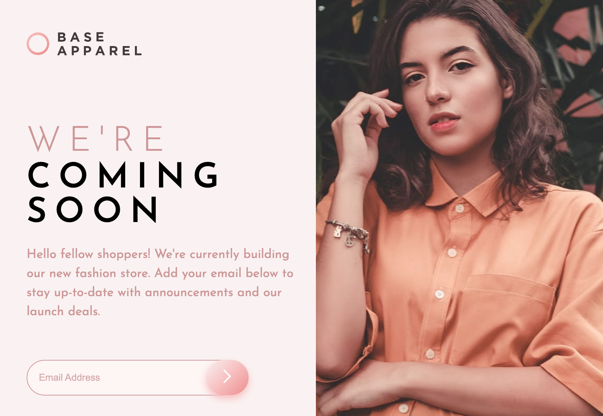

# Frontend Mentor - Base Apparel coming soon page solution

This is a solution to the [Base Apparel coming soon page challenge on Frontend Mentor](https://www.frontendmentor.io/challenges/base-apparel-coming-soon-page-5d46b47f8db8a7063f9331a0). Frontend Mentor challenges help you improve your coding skills by building realistic projects.

## Table of contents

- [Overview](#overview)
  - [The challenge](#the-challenge)
  - [Screenshot](#screenshot)
  - [Links](#links)
- [My process](#my-process)
  - [Built with](#built-with)
  - [Code issues along the way](#code-issues-along-the-way)
  - [Code snippets](#code-snippets)
  - [CSS tips](#css-tips)
  - [Interesting articles](#interesting-articles)
- [Author](#author)

## Overview

### The challenge

Users should be able to:

- View the optimal layout for the site depending on their device's screen size
- See hover states for all interactive elements on the page
- Receive an error message when the `form` is submitted if:
  - The `input` field is empty
  - The email address is not formatted correctly

### Screenshot



### Links

- [Solution URL](https://github.com/codercreative/base-apparel-main)

## My process

- This is my first Read.me file 🎉 It is a great tool for remembering my process and resources.

### Built with

- Semantic HTML5 markup
- CSS custom properties
- Mobile-first workflow

### Code issues along the way

- Tried to use Flexbox -- but Grid turned out to be the best solution in order to get the logo and image to behave the way I needed to when making the page responsive.

- I cannot figure out how to right-align the image at 1440px and greater...

- Main heading and main text - this was a bit more challenging than I thought it would be - what with spans and breaks combined with making the site responsive.

- Deciding on the best way to name CSS classes...🤔

### Code snippets

Here are my favorite code samples for this project:

Make the image span two rows:

```css
.grid-row-span-2 {
  grid-row: span 2;
}
```

Position the submit button just right:

```css
.submit-btn {
  position: absolute;
  transform: translateX(-3em);
}
```

Learned how to change the color of the placeholder text:

```css
input::placeholder {
  color: var(--desaturated-red);
  opacity: 0.5;
}
```

Removed the glowing blue border around the email

```css
input:focus {
  outline: none;
}
```

### CSS tips

For responsive sites and CSS tips, Kevin Powell is the go-to expert. Here's a snippet of some of his tips that I considered while working through this project:

- **Avoid height whenever possible. Websites are naturally responsive.** Consider using the padding property instead. Also, checkout Kevin's em vs rem lesson: [em vs rem](https://youtu.be/_-aDOAMmDHI)

- Youtube episode about
  [rems (-> in relation to root/html) instead of ems for fontsizes, as ems cause compounding problems. Use ems for margin and padding](https://www.youtube.com/watch?v=pautqDqa54I)

Josh W Comeau also has a good solution for how to work with [rems](https://www.joshwcomeau.com/css/surprising-truth-about-pixels-and-accessibility/#the-625-trick). I considered using his suggestion for this coding challenge -- but will keep it in mind for future projects instead.

### Interesting Articles

- [MDN article on the picture element](https://developer.mozilla.org/en-US/docs/Web/HTML/Element/picture) - This helped me when I needed to use a mobile version img vs a differently cropped image for desktop.

- [MDN article on overflow](https://developer.mozilla.org/en-US/docs/Web/CSS/overflow) - Good reminder about the overflow property.

- [Validating email address in JS](https://ui.dev/validate-email-address-javascript)
  Short and sweet JS code for validating email addresses.

## Author

- Frontend Mentor - [@codercreative](https://www.frontendmentor.io/profile/codercreative)
